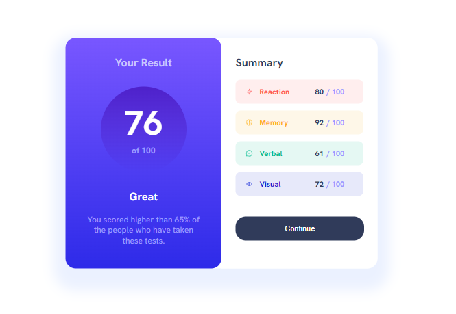
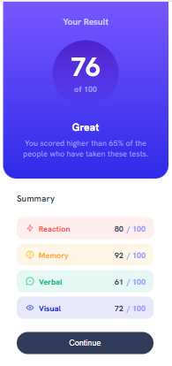

# Frontend Mentor - Results summary component solution

This is my solution to the [Results summary component challenge on Frontend Mentor](https://www.frontendmentor.io/challenges/results-summary-component-CE_K6s0maV). 

## Table of contents

- [Overview](#overview)
  - [The challenge](#the-challenge)
  - [Screenshot](#screenshot)
  - [Links](#links)
- [My process](#my-process)
  - [Built with](#built-with)
  - [What I learned](#what-i-learned)
  - [Continued development](#continued-development)
- [Author](#author)

## Overview

### The challenge

Users are able to:

- View the optimal layout for the interface depending on their device's screen size
- See hover and focus states for all interactive elements on the page
- I also used the local JSON data to dynamically populate the content

### Screenshot

This is a screenshot of desktop version of the site: ,
and this is a mobile version screenshot: 


### Links

- Solution URL: [Add solution URL here]
- Live Site URL: [Add live site URL here]

## My process

### Built with

- Semantic HTML5 markup
- CSS custom properties
- Flexbox
- CSS Grid
- Mobile-first workflow
- [React](https://reactjs.org/) - JS library


### What I learned

This is my first REACT application. So I learnd how to initiate process on react. Styling and classnaming was a new challenge and I made it. I knew about react inline, css file and css modular file stayling. I got knowledge about JSON file and how to import and use it in my react apps. Modular workflow was also challenge. It was hard to style js generated elements, but then I referred them by attribute selector and managed to style anyway. Some hardship was the fact that project didn't have figma design, so I had to style them by my eyesight.


```css
div[alt="Visual"] {
    background-color: hsla(234, 85%, 45%, 0.1);
}

img[alt="Visual icon"] + p {
    color: hsl(234, 85%, 45%);
}
```
```js
{jsonData.map((item, index) => (
          <div key={index} alt={item.category}>
            
            <p className={styles.categoryp}> {item.category}</p>
            <p className={styles.scorep}><span> {item.score} </span> / 100 </p>
               
          </div>
        ))}
```


### Continued development

I have to constinue working on the abovementiond challanges, and then take new ones.

## Author

- Github - [Aleqsa123](https://github.com/Aleqsa123)
- Linkedin - [Aleksi Merebashvili](https://www.linkedin.com/in/aleksi-merebashvili-36627426/)
- Facebook - [Aleksi Merebashvili](https://www.facebook.com/aleksi.merebashvili)
- Frontendmentor - [Aleqsa123] (https://www.frontendmentor.io/profile/Aleqsa123)